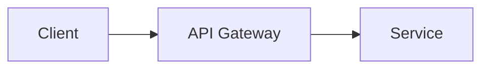

# Design Stage Guide

## Purpose

The Design stage is where you define **"how"** to implement.
It documents technical decisions between Plan and Do.

## Why is the Design Document Important?

### 1. Implementation Efficiency
```
❌ Without design: Repeated direction changes during coding
✅ With design: Fast implementation with clear direction
```

### 2. Gap Analysis Foundation
```
❌ Without design: Can't judge what's correct
✅ With design: Can compare intent vs result
```

### 3. Team Communication
```
❌ Without design: "That's not what I had in mind..."
✅ With design: "I followed the design doc, let me know if it's different"
```

## Design Document Structure

```markdown
# {Feature Name} Design Document

## 1. Overview
{Design goals and principles}

## 2. Architecture
### 2.1 Component Diagram
[ASCII or image]

### 2.2 Data Flow
[Sequence or flowchart]

## 3. Data Model
### 3.1 Entity Definitions
```typescript
interface Entity { ... }
```

### 3.2 Relationships
[ER diagram or description]

## 4. API Specification
### 4.1 Endpoint List
| Method | Path | Description |
|--------|------|-------------|

### 4.2 Detailed Specification
[Request/Response examples]

## 5. UI/UX (if applicable)
[Screen layout, user flow]

## 6. Error Handling
[Error codes, handling methods]

## 7. Test Plan
[Test scope, test cases]
```

## Design Depth by Level

| Section | Starter | Dynamic | Enterprise |
|---------|---------|---------|------------|
| Architecture | Brief | Detailed | Very detailed |
| Data Model | Optional | Required | Required + ER |
| API Spec | - | Required | OpenAPI |
| Error Handling | Basic | Detailed | Complete |
| Testing | Optional | Required | Required + Performance |

## Writing Tips

### 1. Use Diagrams

```
# ASCII diagrams (simple ones)
┌─────────┐     ┌─────────┐
│ Client  │────▶│ Server  │
└─────────┘     └─────────┘

# Mermaid (complex ones - in supported environments)

```

### 2. Interface First

```typescript
// Start with what the data looks like
interface User {
  id: string;
  email: string;
  createdAt: Date;
}

// Then the API
POST /api/users
Request: { email: string, password: string }
Response: User
```

### 3. Define Error Cases in Advance

```markdown
## Error Handling

| Situation | Code | Message | Handling |
|-----------|------|---------|----------|
| Duplicate email | 409 | "Email already in use" | Show form error |
| Wrong password | 401 | "Password does not match" | Request re-entry |
```

## Practical Examples

### Simple Design (Dynamic Level)

```markdown
# Login Design Document

## Architecture
```
Client (React) → bkend.ai Auth API
```

## Data Model
```typescript
interface User {
  _id: string;
  email: string;
  createdAt: Date;
}
```

## API
Using bkend.ai built-in authentication:
- `bkend.auth.login({ email, password })`
- `bkend.auth.logout()`

## Components
- LoginForm: Login form
- useAuth: Authentication state management hook

## Error Handling
| Situation | Handling |
|-----------|----------|
| Wrong password | "Please check your login information" |
| Network error | "Please try again later" |
```

### Detailed Design (Enterprise Level)

```markdown
# Authentication Service Design Document

## 1. Architecture

### 1.1 Overall Structure
```
                    ┌─────────────────┐
                    │   API Gateway   │
                    │   (Kong/Nginx)  │
                    └────────┬────────┘
                             │
         ┌───────────────────┼───────────────────┐
         │                   │                   │
    ┌────▼────┐         ┌────▼────┐         ┌────▼────┐
    │  Auth   │         │  User   │         │  Other  │
    │ Service │         │ Service │         │ Service │
    └────┬────┘         └─────────┘         └─────────┘
         │
    ┌────▼────┐
    │  Redis  │ (sessions/tokens)
    └─────────┘
```

### 1.2 Authentication Flow
1. Client → API Gateway (login request)
2. Gateway → Auth Service (authentication processing)
3. Auth Service → Redis (token storage)
4. Auth Service → Gateway → Client (JWT return)

## 2. API Specification

### POST /api/auth/login
**Request:**
```json
{
  "email": "string",
  "password": "string"
}
```

**Response (200):**
```json
{
  "accessToken": "string",
  "refreshToken": "string",
  "expiresIn": 3600
}
```

**Errors:**
- 400: Invalid input
- 401: Invalid credentials
- 429: Too many attempts

## 3. Security Considerations
- Password: bcrypt (cost 12)
- JWT: RS256 algorithm
- Refresh Token: 7-day validity, HttpOnly Cookie
- Rate Limiting: 5 attempts / minute
```

## Design vs Implementation Synchronization

### Rules
1. **Before implementation**: Read design document
2. **During implementation**: If different from design, update design first
3. **After implementation**: Check differences with Gap analysis

### When Design Changes
```markdown
## Version History

| Version | Date | Changes |
|---------|------|---------|
| 1.0 | 2024-12-01 | Initial draft |
| 1.1 | 2024-12-10 | Social login added (decided during implementation) |
```

## Next Steps

After writing Design:
1. **Request implementation**: "Implement the login feature"
2. **After implementation complete**: `/pdca-analyze [feature name]`

## Related Documents

- [Check/Act Stage Guide](./check-act-guide.md)
- [Design Template](../../templates/design.template.md)
